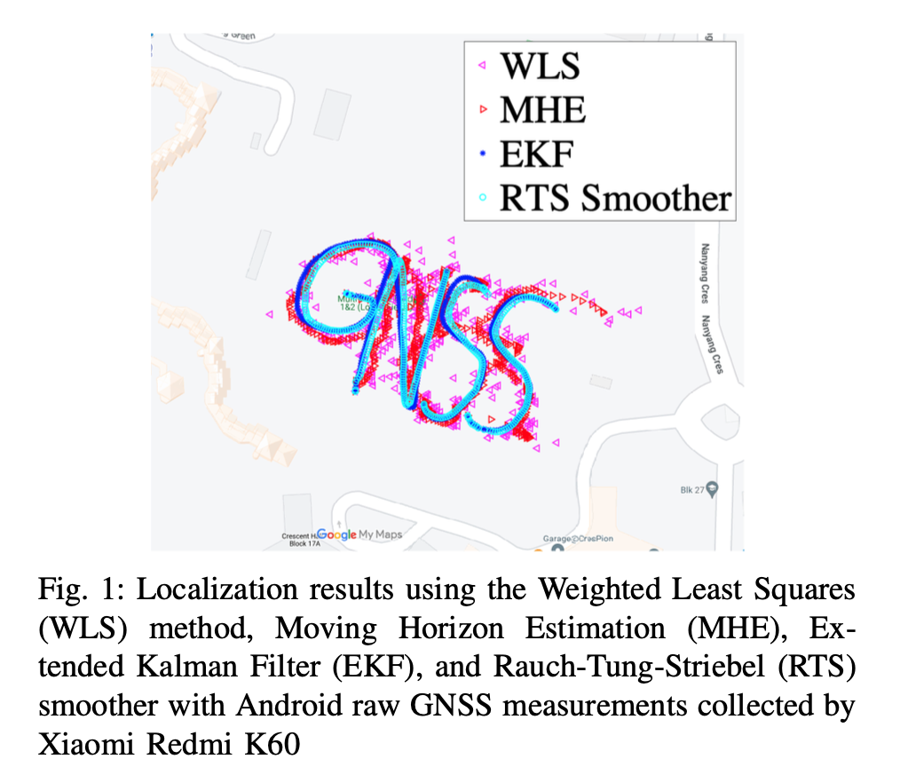

# MATLAB Codes for Pseudorange Positioning with Android Raw GNSS Measurements
The codes are the implementation of the following paper:

`Weng, X., & Ling, K. V. (2023). Localization with Noisy Android Raw GNSS Measurements. 2023 IEEE Asia Pacific Conference on Wireless and Mobile (APWiMob)`

<!--- Badge for paper link---> 
<!--- Badge for slides link--->
<!--- Badge for award---></a>

## Introduction
Our codes are based on [Google's open source GNSS software](https://github.com/google/gps-measurement-tools). Everyone should review this awesome contribution first.

Compared to Google's codes, where they did the baseline weighted least squares (WLS) to compute user positions, we support moving horizon estimation (MHE), extended Kalman filter (EKF), and Rauch-Tung-Striebel (RTS) smoother for noise suppression. Our results are shown below.

## Data
We provide the data collected by us in static scenarios as well as the data collected by Google in dynamic scenarios.

Static data is put under:

`androidGnss/data/HuaweiMate10Pro/Training_data`

Dynamic data (Google Smartphone Decimeter Challenge-GSDC) is put under

`androidGnss/data/GSDC`

More GSDC data can be found at [GSDC 2021](https://www.kaggle.com/c/google-smartphone-decimeter-challenge) and [GSDC 2022](https://www.kaggle.com/c/smartphone-decimeter-2022/discussion/341111).

## Using our Codes
👩🏽‍💻 The code is put under `androidGnss/GPS_opensource_software`.

The main entrance of the software includes:
* for static data:

  `ProcessGnssMeasScript_Static_NTU.m`  
* for dynamic data collected in Mountain View areas in 2020:

  `ProcessGnssMeasScript_Dynamic_MTV.m`
* for dynamic data collected in Mountain View and San Jose areas in 2021:

  `ProcessGnssMeasScript_Dynamic_SJC.m`

Then, you need to
* set the directory of your Android raw GNSS data file, e.g.:
      
      dirName ='../data/HuaweiMate10Pro/Training_data/2022-10-09-NTU-ADM-4';
* specify the name of your Android raw GNSS data file, e.g.:

      prFileName = 'HuaweiMate10Pro_GnssLog.txt';
* specify the name of the ground truth data file, e.g.:

      gtNmeaFileName = 'NTU-ublox-GT.csv';
* run `ProcessGnssMeasScript_Static_NTU.m` (for example) to process Android raw GNSS measurements;

## 😃 Thank you for your interest in our work. Kindly cite our paper!
